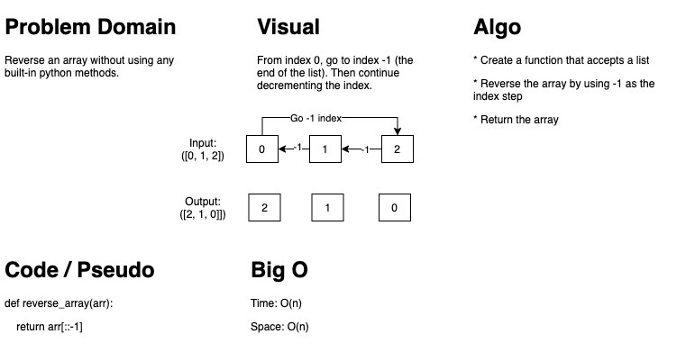

# Data Structures and Algorithms

## Create a copy of this repository

1. Create a new repository in your GitHub account called `data-structures-and-algorithms`
1. Clone the empty repository to your machine
1. Choose the "Download" option under "Clone or Download" for this repository
1. Copy that .zip file inside of the local `data-structures-and-algorithms` repo created in step 2
1. Unzip the file there
1. Remove the .zip file
1. Run the command `npm install` from the repository root directory
1. Do an `ACP` of the `data-structures-and-algorithms` repository

## Repository Quick Tour and Usage

### 301 Code Challenges

Under the `data-structures-and-algorithms` repository, at the top level is a folder called `code-challenges`

Each day, you'll add one new file to this folder to do your work for the day's assigned code challenge

### 401 Data Structures, Code Challenges

- Each Data Structure should be implemented separately in a language specific manner, in a properly named folder.
  - i.e. `linked-lists`
- For daily challenges:
  - Each implementation should have a challenges folder, named `challenges`
  - Within the challenges folder, a subfolder bearing the name of the challenge
    - i.e. `remove-duplicates`
  - Within the proper subfolder:
    - A README.md that will house your challenge summary, whiteboard photos
    - Your implementation and tests for the code challenge
    - Perform your work in accordance with your 401 language's instructions

The final structure should resemble this:

```bash
  data-structures-and-algorithms
  |
  ├── code-challenges
  │  └── challenge-01.test.js
  │  └── challenge-02.test.js
  │  └── ...
  |
  ├── [language]
  │   └── [data-structure-name]
  │       └── challenges
  │   └── [data-structure-name]
  │       └── challenges
  │   └── [data-structure-name]
  │       └── challenges
  │   └── ...
  |
  ├── node_modules
  |
  ├── .github
  │   └── workflows
  │       └── javascript-tests.yml
  │
  ├── .eslintrc.json
  ├── .gitignore
  ├── package-lock.json
  ├── package.json
  └── README.md
```

301 Code Challenges:
[Challenge 01](code-challenges/challenges-01.test.js)
[Challenge 02](code-challenges/challenges-02.test.js)
[Challenge 03](code-challenges/challenges-03.test.js)
[Challenge 04](code-challenges/challenges-04.test.js)
[Challenge 05](code-challenges/challenges-05.test.js)
[Challenge 06](code-challenges/challenges-06.test.js)
[Challenge 07](code-challenges/challenges-07.test.js)
[Challenge 08](code-challenges/challenges-08.test.js)
[Challenge 09](code-challenges/challenges-09.test.js)
[Challenge 10](code-challenges/challenges-10.test.js)
[Challenge 11](code-challenges/challenges-11.test.js)
[Challenge 12](code-challenges/challenges-12.test.js)
[Challenge 13](code-challenges/challenges-13.test.js)
[Challenge 14](code-challenges/challenges-14.test.js)

401 Code Challenges:
[Challenge 01](python/challenges/array_reverse/array_reverse.py)

[Link to PR](https://github.com/holdermatthew5/data-structures-and-algorithms/pull/19#issue-534133306)